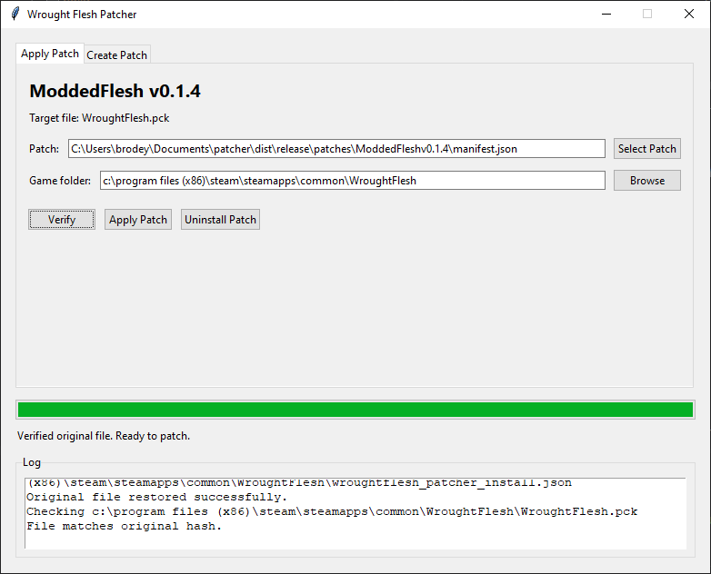
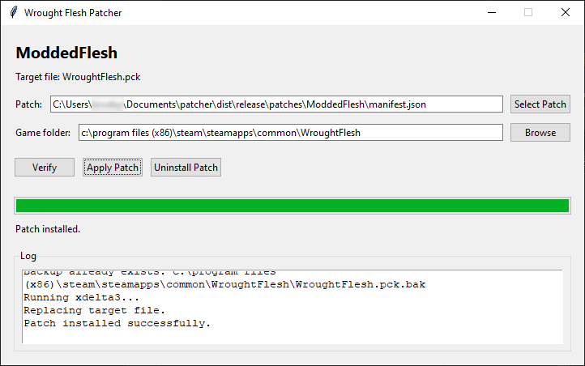

# Wrought Flesh Patcher GUI

This patcher applies `xdelta3` binary patches to a user's existing game file.
It does not distribute the original game file.

The GUI supports multiple mods. Each mod provides its own patch manifest with
its own source hash, patched hash, and `.xdelta` file.

## Screenshots





## End-User Folder Layout

Distribute a folder like this:

```text
WroughtFleshPatcher.exe
patches/
  example-mod/
    manifest.json
    wroughtflesh_mod.xdelta
  another-mod/
    manifest.json
    another_mod.xdelta
```

Users click `Select Patch`, choose a mod's `manifest.json`, choose their game
folder, then click `Apply Patch`.

## ModdedFlesh

ModdedFlesh is now maintained separately at
[github.com/bbrodo/ModdedFlesh](https://github.com/bbrodo/ModdedFlesh). It is a
mod for the current version of Wrought Flesh that aims to fix bugs and
performance issues introduced in newer versions of the game.

During development, run the Python script directly:

```powershell
py .\patcher_gui.py
```

## Patch Manifest

Each patch folder needs a `manifest.json`:

```json
{
  "name": "Example Mod",
  "steam_app_id": 0,
  "steam_install_dir": "Wrought Flesh",
  "target_file": "WroughtFlesh.pck",
  "original_sha256": "replace_with_sha256_of_clean_original_pck",
  "patched_sha256": "replace_with_sha256_of_modded_pck",
  "patch_file": "wroughtflesh_mod.xdelta",
  "backup_suffix": ".bak"
}
```

`patch_file` is relative to the manifest folder, so each mod can keep its patch
file next to its own manifest.

## Create A Patch

Put these files in a work folder:

```text
original.pck
modded.pck
xdelta3.exe
```

Create the patch:

```powershell
.\xdelta3.exe -e -s .\original.pck .\modded.pck .\wroughtflesh_mod.xdelta
```

Get hashes:

```powershell
Get-FileHash .\original.pck -Algorithm SHA256
Get-FileHash .\modded.pck -Algorithm SHA256
```

Put the original hash into `original_sha256` and the modded hash into
`patched_sha256`.

## Test A Patch Manually

Before using the GUI, verify the patch:

```powershell
.\xdelta3.exe -d -s .\original.pck .\wroughtflesh_mod.xdelta .\patched.pck
Get-FileHash .\patched.pck -Algorithm SHA256
```

The patched hash must match `modded.pck`.

## What The GUI Does

1. Lets the user select a patch manifest.
2. Lets the user select the game folder.
3. Optionally auto-detects the Steam install from `steam_app_id`.
4. Verifies the target file hash.
5. Creates a `.bak` backup.
6. Runs `xdelta3`.
7. Verifies the patched hash.
8. Replaces the target file.
9. Can uninstall by restoring the backup.
